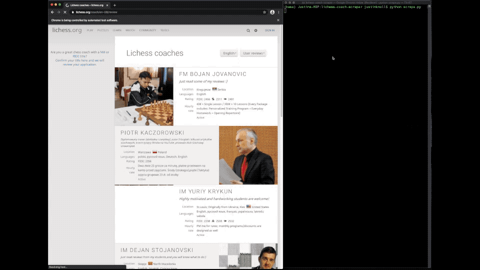
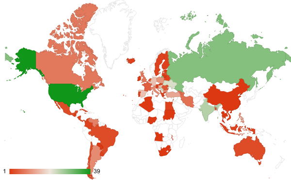

# lichess-coach-scraper
Python code to scrape [lichess.org coach listing](https://lichess.org/coach) metadata and generate a .csv for subsequent analysis. Lichess has a strong community of title-verified coaches with a variety of ratings, rates, and locations, but does not expose structured data or search tools allowing a prospective student to sort and filter on these criteria, which makes it challenging to find a suitable coach in a mutually convenient timezone.

## Fields extracted

It uses [Selenium](https://www.selenium.dev/) for browser automation and generates a file containing selected metadata, currently

    coach['Name']
    coach['Country']
    coach['Rate']
    coach['Rating']
    coach['Link']

Modification to add additional fields via Selenium selectors is trivial. Unfortunately, some of the key fields are unstructured (e.g. `Rate`, which is a free text input and includes various currencies and human-readable notes such as "package discounts available") and others are not validated (e.g. `Country`)

The output of this script is a .csv which is suitable for analysis by a tool of your choice or for import into Google Sheets, where you can create pivot tables, slicers, or other views to find good candidate coaches.

## Video
Infinite scroll of the page is automated, data is scraped and coach `Name` written to stdout. The scraped data fields (including `Name`) are written to `coaches.csv`

## Example Post-Analysis

Breakdown of number of coaches available in each country; countries coded white have zero coaches. This analysis was created in Google Sheets using an import of the generated .csv, a pivot table, and the map chart type. It is provided as an example.

